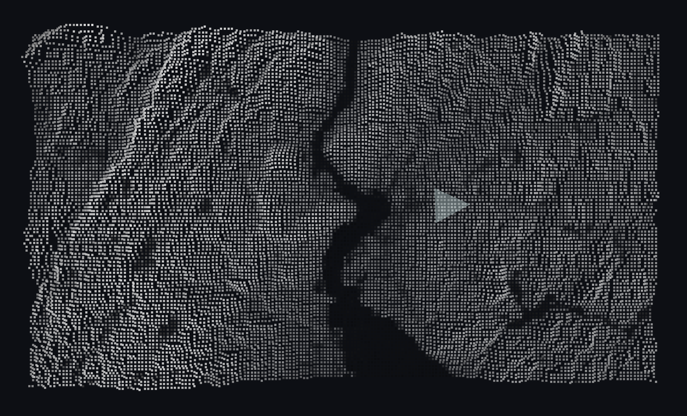

# 3D Point Cloud Terrain Viewer 🗺️

An interactive 3D terrain visualization tool that renders point cloud data from heightmaps and NDVI imagery.

[](docs/images/screenshot1.png)

## 🚀 Features

- **Interactive 3D Visualization** - Real-time rendering using OpenGL
- **Dynamic Navigation** - Intuitive camera controls with mouse and keyboard
- **Elevation-Based Rendering** - Height-dependent coloring and transparency
- **Performance Optimized** - Efficient point cloud filtering and viewport management
- **NDVI Integration** - Blends vegetation index visualization

## 📋 Prerequisites

- Python 3.8 or higher
- OpenGL-compatible graphics hardware
- Operating System: Windows/macOS/Linux

## 🛠️ Installation

1. Clone the repository
   ```bash
   git clone https://github.com/jgferdinando/terrain-viewer.git
   cd terrain-viewer
   ```

2. Create and activate a virtual environment
   ```bash
   # Windows
   python -m venv venv
   venv\Scripts\activate

   # macOS/Linux
   python3 -m venv venv
   source venv/bin/activate
   ```

3. Install dependencies
   ```bash
   pip install -r requirements.txt
   ```

## 📦 Required Data Files

Place these files in your project directory ('./src/images/') or replace with a heightmap and grayscale image:

- `nyTerrain.png` - Heightmap image (grayscale or RGB)
- `ndvi_nyState.png` - NDVI or brightness data image

## 🎮 Controls

| Action | Control |
|--------|---------|
| Move Camera | Arrow Keys ← ↑ → ↓ |
| Zoom | Mouse Scroll Wheel |
| Pan View | Left Click + Mouse Move |
| Exit | ESC |

## 🚀 Usage

```python
python terrain_viewer.py
```

## 🔧 Configuration

Default settings can be adjusted in the script:

```python
# Screen settings
WIDTH, HEIGHT = 1600, 900
POINT_SIZE = 4

# Camera settings
camera_x, camera_y, camera_z = 2300, -1850, 150
camera_speed = 5.0
```

## 💻 Technical Details

### Input File Requirements

- **Heightmap Image**: RGB/Grayscale image where pixel values represent elevation
- **NDVI Image**: RGB image containing vegetation index or surface characteristics
- Both images should have identical dimensions/resolution

## License

This project is licensed under the GNU General Public License v3.0 - see the [LICENSE](LICENSE) file for details.

### Dependency Licenses

This project incorporates material from several open-source projects:

- [HEALPix](http://healpix.sourceforge.io/) (GPL-2.0+) - Used for spherical grid implementation
- [PyOpenGL](http://pyopengl.sourceforge.net/) (BSD 3-Clause) - Used for 3D rendering
- [Pygame](https://www.pygame.org/) (LGPL) - Used for window management and user interface
- [NumPy](https://numpy.org/) (BSD 3-Clause) - Used for numerical computations

In accordance with the GPL, the complete source code of this project and any modifications to GPL-licensed components are made available under the same license terms.

### Rights Granted

Under this license, you are free to:
- Use this software for any purpose
- Change the software to suit your needs
- Share the software with others
- Share your changes with others

### Obligations

When using this software, you must:
- Include the original license and copyright notices
- Make your source code available when distributing the software
- Document changes you make to the software
- Use the same license (GPL-3.0) for any derivative works

## 🙏 Acknowledgments

- OpenGL for 3D rendering capabilities
- Pygame community for window management tools
- NumPy and Pandas for efficient data processing


